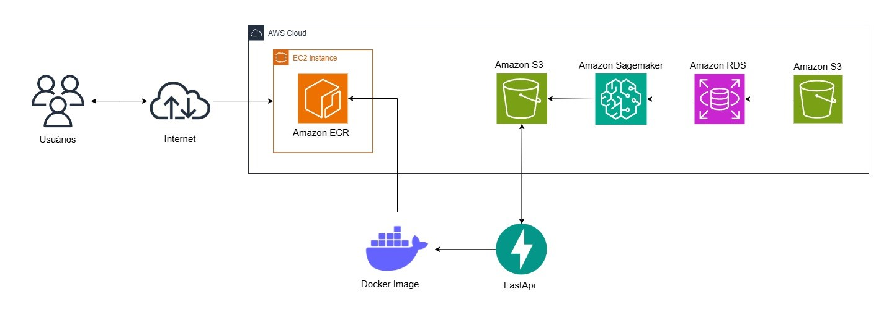

# Hotel Price Prediction 🏢

## Sobre o Projeto

Este projeto realiza a predição do preço de reservas de hotel utilizando um modelo Random Forest treinado no AWS SageMaker. Os dados são carregados e preparados em notebooks Jupyter, e armazenados no AWS S3 e no RDS. A predição é disponibilizada através de uma API construída com FastAPI, que carrega o modelo diretamente do S3.

## 🌐 Arquitetura AWS

## 👨‍💻 Autor
[Gabriel Venancio de Avelar](https://github.com/gabrielvavelar)
